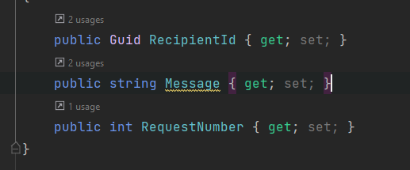

# Краткий гайд на бэк

## Дефолтные зареганые пользователи (login/password/role)
admin/admin/Admin
manager/manager/Manager
client/client/Client
epmty/empty/Manager

Профиль есть у всех, кроме `empty`

## Аккаунт (`/Accounts`)

### Регистрация

По дефолту есть сущность Админа (Admin/Admin).
Он регает новых юзеров
Чтобы создать пользователя:
- В роут `/Register` кинуть запрос на создание(все поля обязательные)
- В ответ получить `Id` пользователя, которого мы создаём. На бэке генерится ссылка на установку пароля для юзера вида 
`/Password/{Id}` и отправляется на почту, указанную при реге.
- Пользователь мереходит по ней и устанавливает. Всё по тому же роуту кидает запрос на бэк.
- ~Позже прикручу поддтверждение по мылу, чтобы не пришлось кидать ссылки и для безопасности пользователей так скажем~ Прикрутил мыло

### Вход/выход
По роутам `/Login` и `/Logout`

### Смена пароля для авторизованного пользователя
по роуту `/Password/Change`

### Восстановление пароля
по роуту `/Password/{Id}`
Пароль у юзера сброситься и юзеру придёт письмо на почту с ссылкой вида `/Password/{Id}`. Логика такая же как при регистрации.


## Профиль (`/Profiles`)

### Создание

По дефолту профиля у чела нет. Его нужно создать, кинув `POST` запрос в контроллер. Контроллер по авторизации

### Просмотр других профилей

Чтобы посмотреть профиль нужно кинуть `GET` на
- `/My` профиль авторизованного юзера
- `/{id}` профиль юзера по `id`
- Get-запрос на контроллере -поиск по профилям


## Чат (`/Chats`)

### Контроллер 
- `/My` список чатов пользователя
- `/ByUser` список чатов у определённого пользователя
- `/Messages` отправить сообщение (нужен для тестов, если `Hub` не рабоает, чтобы понять что не так)

### Hub
- `Send` отправить сообщение в чат/пользователю. 
Принимает 

где:
Recipient - получатель (id чата или id пользователя)
Message - сообщение 
RequestNumber - номер запроса. Нужен чтобы хаб ответил когда сообщение будет доставлено

Сценарий такой:
Если нет чата, то отправляем сообщение пользователю. Чат сам создастся, сообщ отправится
Если есть чат, то просто отправляем по id чата

Ответы:
- `Error` - получаем, если возникает ошибка при отправке
- `Recieve` - получают все юзеры в чате. Они получают то же самое, что и в Контроллере в POST`/Messages` 
- `Success` - получаем если ответ положительный. Вида 
```
ChatId
RequestNumber
```